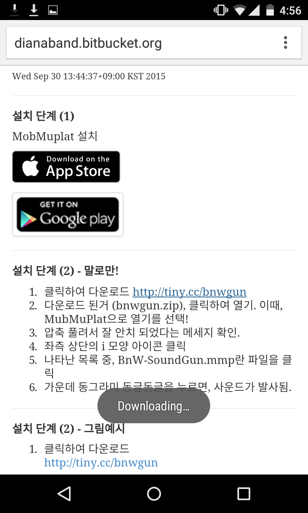
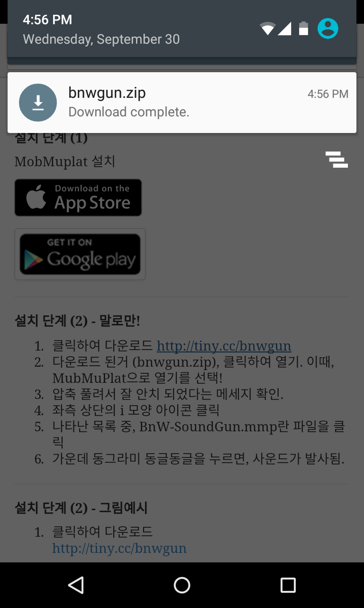
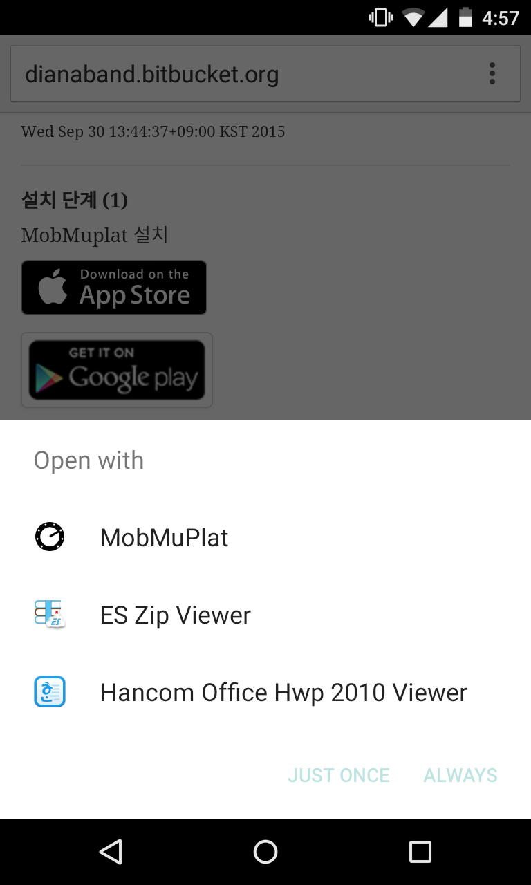
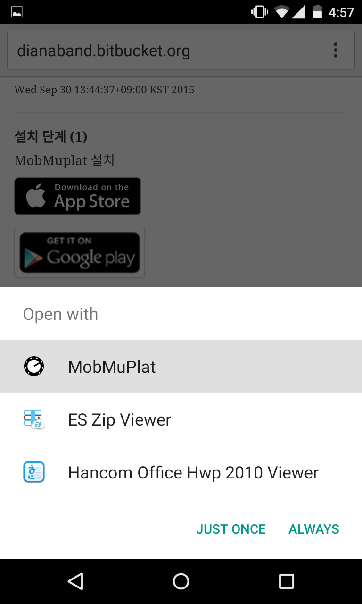
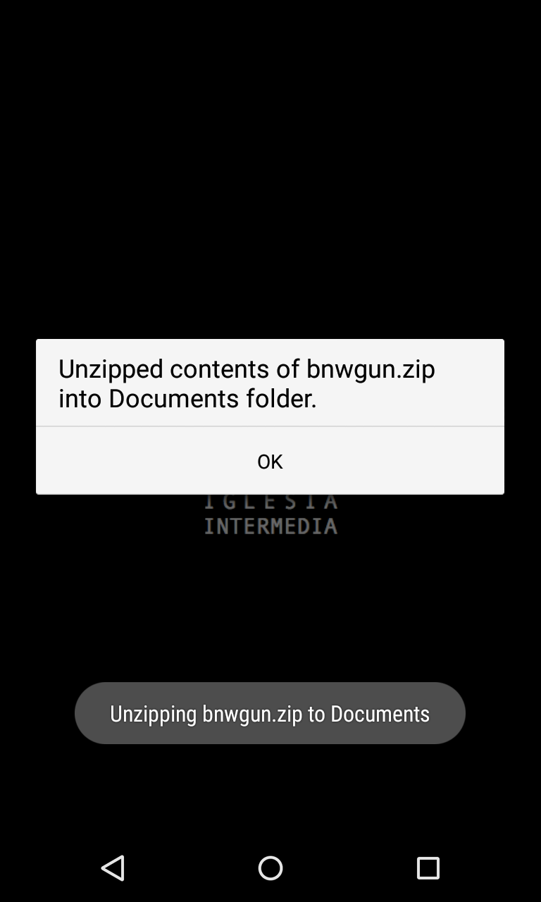
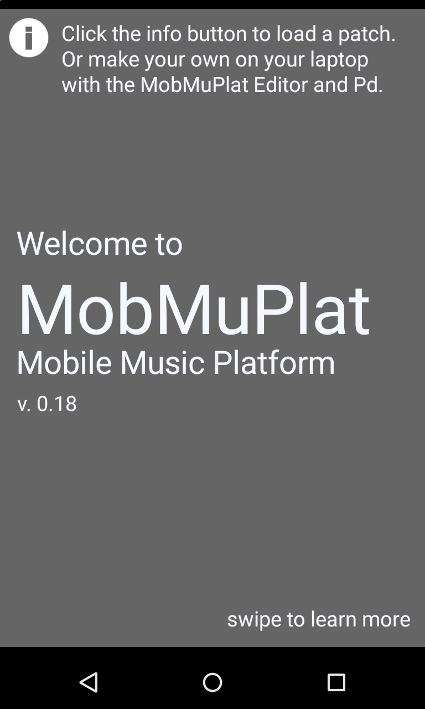
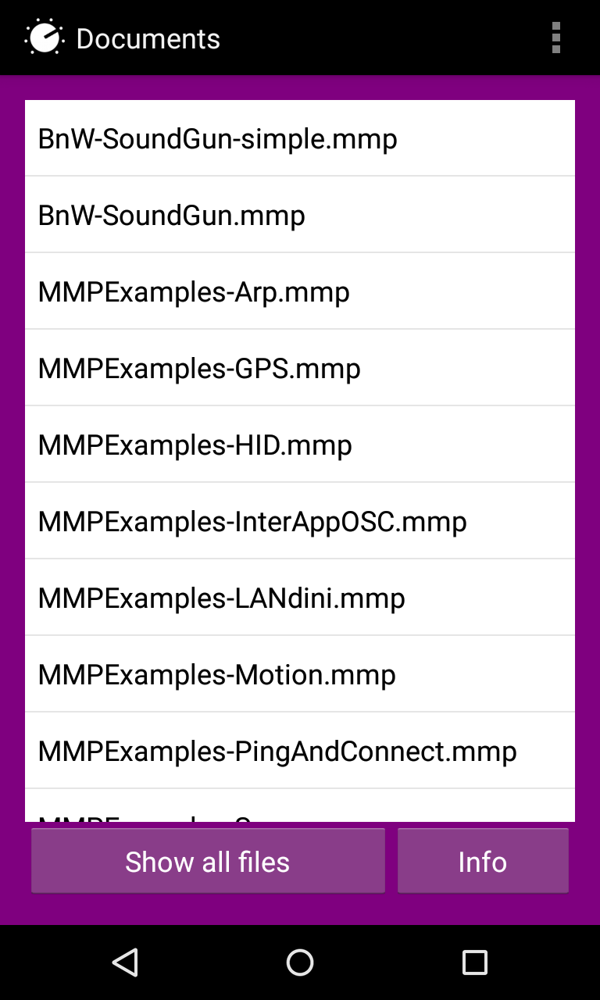
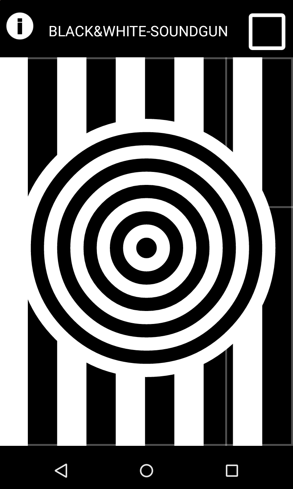

## Black and White Sound GUN 사용 매뉴얼

### 설치 단계 (1) - MobMuplat 설치

**단계 2 진행전 설치 완료 필수!**

### 설치 단계 (2) - 따라하기, 말로만~

1. 클릭하여 다운로드 <http://bnwgun.github.io/bnwgun.zip>
2. 다운로드 된거 (bnwgun.zip), 클릭하여 열기. 이때, MubMuPlat으로 열기를 선택!
3. 압축 풀려서 잘 설치되었다는 메세지 확인.
4. 좌측 상단의 i 모양 아이콘 클릭
5. 나타난 목록 중, BnW-SoundGun.mmp란 파일을 클릭
6. 가운데 동그라미 동글동글을 누르면, 사운드가 발사됨.

### 설치 단계 (2) - 따라하기, 그림예시랑 같이, @.@!

* 클릭하여 다운로드 <http://bnwgun.github.io/bnwgun.zip>

* 다운로드 된거 (bnwgun.zip), 클릭하여 열기. 이때, MubMuPlat으로 열기를 선택!

* 압축 풀려서 잘 설치되었다는 메세지 확인.

* 좌측 상단의 i 모양 아이콘 클릭

* 나타난 목록 중, BnW-SoundGun.mmp란 파일을 클릭

* 가운데 동그라미 동글동글을 누르면, 사운드가 발사됨.

### 참고 내용

- 참고1. 폰이 느리면, BnW-SoundGun-simple.mmp로 실행하면 좀 나을 수도...

- 해커 코스. 직접 소리를 녹음하는 것도 가능함. 좌측 상단의 i 모양 아이콘 클릭 후, 목록 제일 끝, bnwgrab10.mmp 실행. **설명 없음!** 힌트는 menu/new sound 를 눌러줘야 소리 녹음됨.

- 연락처 및 정보 : <http://dianaband.info>

- Git repository : <https://github.com/bnwgun/bnwgun.github.io>

---

######20151001  12:08:55+09:00 KST